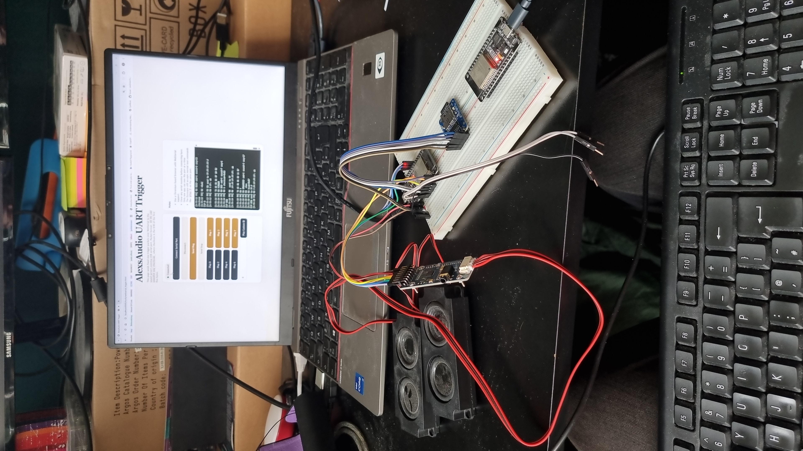

# AlexsAudio

This repository is the shared home for the AlexsAudio ESP32 audio bring-up work.

## Hardware Demo



*Current bench setup: the `trigger_client` is at the bottom right and uses ESP-NOW to request playback from the `sound_server`, which is the ESP32 on the upper-left side of the breadboard. The sound server is the board connected to the microSD card for file lookup and to the WM8960 audio hardware for speaker / audio output drive. The laptop screen is showing the browser-based WebSerial trigger console used for bench testing and manual control.*

It currently contains four PlatformIO projects plus the shared design notes:

- `sd_card_bringup/`
  - standalone microSD hardware and filesystem bring-up
- `sound_server/`
  - WM8960 + SD integration bring-up for the dedicated sound-server ESP32
- `wm8960_wav_bringup/`
  - minimal WM8960 + SD WAV playback diagnostic project
- `trigger_client/`
  - embedded trigger sender that can drive the sound server over ESP-NOW or wired UART
  - [TWO_ESP32_AUDIO_ARCHITECTURE.md](TWO_ESP32_AUDIO_ARCHITECTURE.md)
  - higher-level notes about the overall system direction
- [COMMUNICATION_TRIGGER_PLAN.md](COMMUNICATION_TRIGGER_PLAN.md)
  - phased plan for transport-neutral trigger handling over CLI, `UART`, and `ESP-NOW`

## Repository Layout

```text
AlexsAudio/
|-- sd_card_bringup/
|-- sound_server/
|-- wm8960_wav_bringup/
|-- trigger_client/
|-- shared/
|-- COMMUNICATION_TRIGGER_PLAN.md
|-- TWO_ESP32_AUDIO_ARCHITECTURE.md
|-- .gitignore
`-- README.md
```

## Current Focus

The current work is centered on building out the sound-server in stable vertical slices:

1. verify reliable SD-card access
2. verify WM8960 codec bring-up
3. scan and resolve sound files from SD
4. add real WAV playback
5. trigger playback over a shared packet-based transport
6. drive the sound server from a second ESP32 client over wired UART or ESP-NOW
7. harden transport behavior for the intended game integration

The current known-good playback baseline is:

- WM8960 + SD card on the dedicated `sound_server`
- WAV files on SD as `44100 Hz`, `stereo`, `16-bit PCM`
- trigger commands sent from `trigger_client` over `ESP-NOW`

With that configuration, playback is now sounding clean and feels responsive in bench testing.

## Working In This Repo

Each subproject is a separate PlatformIO project. Build, upload, and monitor from the corresponding folder.

The ESP32 boards currently being used are labeled `ESP32 DEV KIT V1`.
For pin-label translation between GPIO numbers and the board silk screen, see:

- [ESP32 DEV KIT V1 pinout reference](docs/ESP32-DOIT-DEV-KIT-v1-pinout-mischianti.png)

Examples:

```powershell
cd .\sd_card_bringup
C:\Users\alanb\.platformio\penv\Scripts\platformio.exe run

cd ..\sound_server
C:\Users\alanb\.platformio\penv\Scripts\platformio.exe run
C:\Users\alanb\.platformio\penv\Scripts\platformio.exe device monitor -b 115200 --echo

cd ..\trigger_client
C:\Users\alanb\.platformio\penv\Scripts\platformio.exe run
C:\Users\alanb\.platformio\penv\Scripts\platformio.exe device monitor -b 115200 --echo
```

## Next Steps

- package the current working `trigger_client` -> `sound_server` ESP-NOW flow as a clean demo for Alex
- decide whether wired UART / RS-485 remains only a fallback or stays as a supported transport option
- decide whether to keep broadcast ESP-NOW for bring-up only or move to explicit peer MACs for the real build
- move the working audio hardware off the most fragile breadboard wiring when convenient, keeping the proven I2C pull-ups
